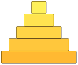
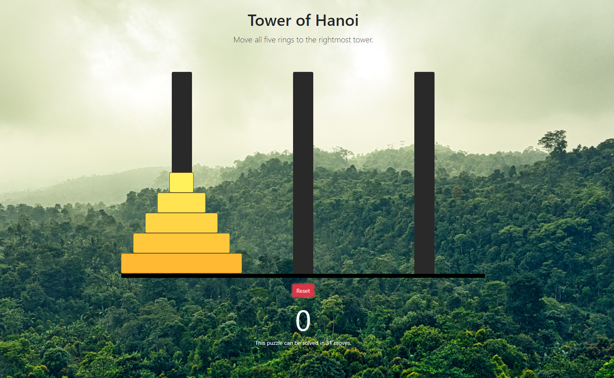
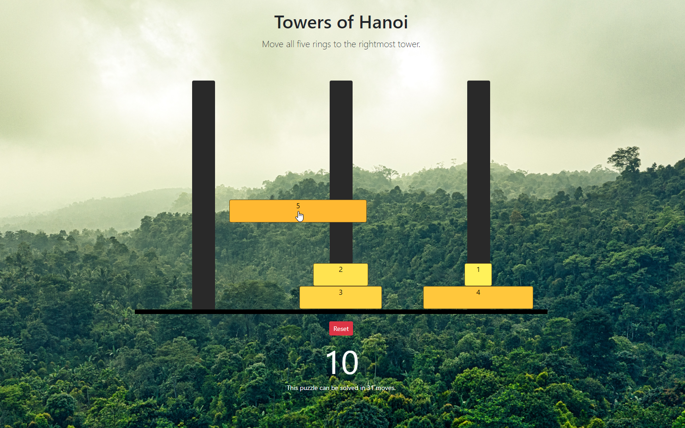

  

# Tower of Hanoi
**by Curtis Yungen**

September 2019

The Tower of Hanoi is a mathematical game or puzzle consisting of three tower and five discs of different sizes. The puzzle begins with all five discs stacked on the left-most tower. The objective of the game is to move the entire stack to the right-most tower while abiding by three simple rules: 

1. Only one disk can be moved at a time.
2. Each move consists of taking the upper disk from one of the stacks and placing it on top of another stack or on an empty rod.
3. No larger disk may be placed on top of a smaller disk.

Read more here: https://en.wikipedia.org/wiki/Tower_of_Hanoi

### Technologies
1) Node.js
2) Express.js
3) ReactJS
4) Redux

### NPM Dependencies
1) express
2) react-dom
3) react-redux
4) react-scripts
5) redux

### Download Instructions

*Ensure that you have installed a Code Editor such as Visual Studio Code as well as Node.js.
Installation instructions for Node.js can be found here: https://nodejs.org/en/download/*

1) Visit https://github.com/curtisyungen/tower-of-hanoi
2) Click on the green button labeled Clone or download
3) Select Download ZIP
4) Open the ZIP file and extract its contents to the desired location on your computer
5) Open Visual Studio Code or the editor of your choice
6) Open a new terminal in your code editor
7) Install all dependencies by running the command "npm install"
8) Start the program by typing the command "npm start" in your terminal
9) The program will open locally in your browser

### Screenshots

 

 

